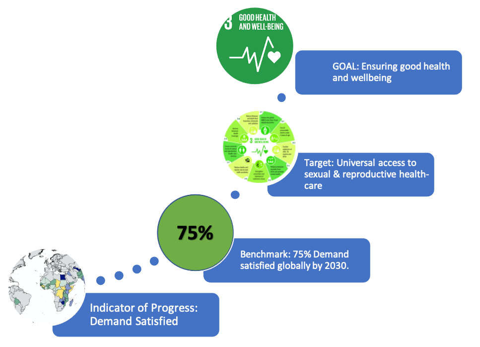

As individuals, how do we get from where we are to where we want to be? Many people chose to set targets for themselves that will help them work towards achieving their goals. Let's assume your goal is to buy a House. You don't just expect to wake up one day and for the bank to hand you a mortgage. You need to save for a deposit (your target) and in this context you might also give yourself a medium-term savings target to keep you on track. Then all you need is some indicator of progress, for example, when trying to meet your deposit target you can recognize the importance of monitoring monthly savings. 


Obviously I'm not here to talk to you about your house buying goals. But I do want to talk to you about goal setting on a much larger scale, i.e., The Sustainable Development Goals (SDGs). The SDGs are a collection of 17 interlinked global goals designed to be a "blueprint to achieve a better and more sustainable future for all" (https://sdgs.un.org/goals). Overall, these ambitious goals relate to eradicating poverty and hunger, reducing inequality, tackling climate change and ensuring good health. For these goals to become a reality they need associated targets and if we want to evaluate the likelihood of meeting these targets then we need an indicator of progress (sound familiar?).


 
Our focus here will be on SDG number 3 - ensuring good health and well being - which has 13 associated targets. One of these targets is to ensure universal access to sexual and reproductive health-care services.  So now, we have an ambitious goal and a corresponding target. All that's left is to determine how to monitor progress. Fortunately, we can use information that we have about a family planning indicator called Demand Satisfied, which tells us how much of the demand for contraception is satisfied by modern contraceptive methods. A global benchmark that has been proposed for this indicator, in working towards achieving universal access to sexual and reproductive health-care services, is to have at least 75% of the demand for family planning satisfied with modern contraceptives in all countries by 2030. 





We will now consider how 68 of the world's poorest countries can get from where they currently are to where they want to be in terms of reaching the 75% benchmark for demand satisfied. How will we do this? Well, luckily statisticians have a unique superpower that allows us to see into the future. Unluckily for us, that super-power comes with the caveat that our sight gets a bit blurry the further into the future we go. We of course have to acknowledge the uncertainty that comes with blurred vision. Keeping that in mind, we can use statistical models to take a look into the future and see in what year we expect countries to meet the proposed demand satisfied benchmark of 75%.  

We’ll consider Afghanistan as an example first of all. Our statistical models tell us that the 75% benchmark is not expected to be met until 2054. This is in a year when about 5 in every 10 married or in-union women are expected to be using modern methods of contraception. If we compare this to 2030, only 2 in every 10 married or in-union women are expected to be using modern methods. This means that meeting the 75% benchmark for demand satisfied in  Afghanistan will require the country to reach a level of modern contraceptive use in 2030 that is about 30 percentage points above what is expected. Another way of thinking about this is that Afghanistan needs to meet the 75% demand satisfied benchmark 3 times faster than it is currently expected to do. Thinking about it in this way, we say that the country requires a relative acceleration of 3. 


We know now that increasing demand satisfied in Afghanistan needs to happen at a faster rate if the country hopes to meet the 75%  benchmark by 2030. What about other countries? Of the 68 countries we considered, overall 50 out of 68 are expected to reach 75% demand satisfied in some year after 2030 and therefore will require a higher level of modern contraceptive use in 2030 relative to what's  currently expected. At the lower end of this spectrum, countries will need to reach 75% demand satisfied about a year earlier than expected. At the higher end of the spectrum countries will need to increase levels of demand satisfied to 75% 7 times faster than what's currently expected.  Whether these accelerations are feasible or not remains to be seen, but there is no doubt that some countries face more of a challenge than others. One thing is clear, knowing what is required in order for countries to meet proposed benchmarks is vital for the successful implementation of Family Planning programs that will ultimately help achieve the SDGs.  


```
---
title: Satisfying the Demand for Family Planning - What Will it Take to Meet a 75% Benchmark by 2030?
date: 2021-02-18
---
```

