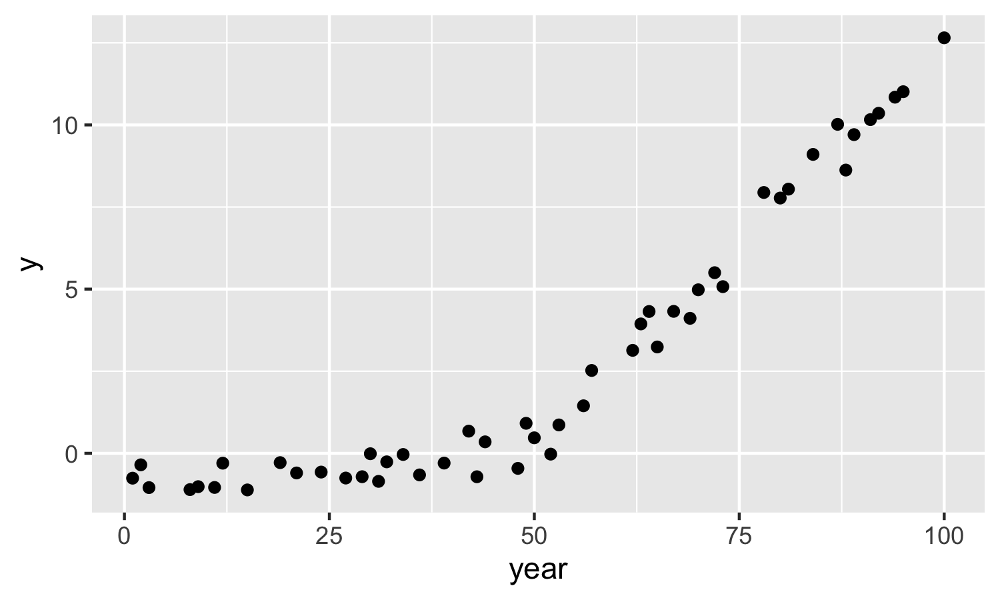
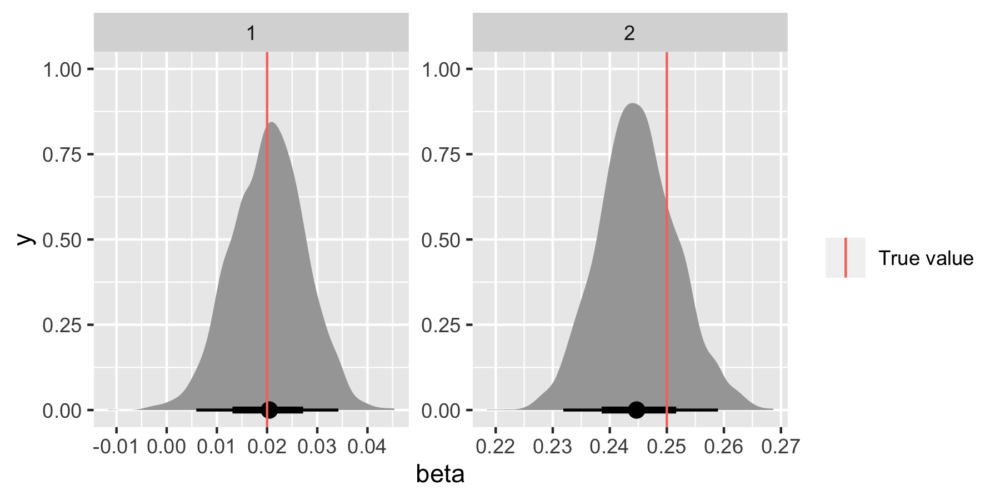
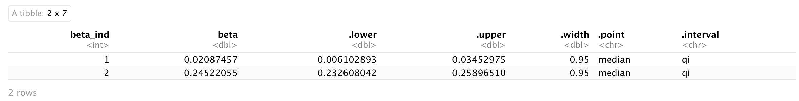
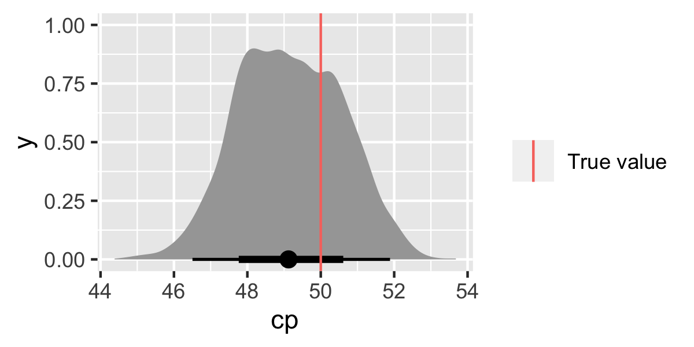
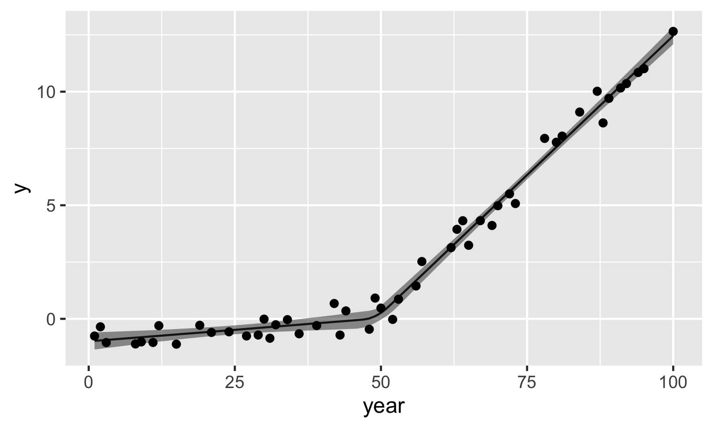

## Introduction
One of the first models I worked on during my PhD was a change-point linear regression model for time series data. This model is relatively simple to implement and it can be really useful for answering questions related to changes in trends over time. Over the years I've used versions of this model in a number of different applications, such as looking for [timings of changes in regional sea level records](https://www.whoi.edu/cms/files/Kemp2013QSR_170144.pdf), investigating claims about the [global warming hiatus](https://iopscience.iop.org/article/10.1088/1748-9326/10/8/084002) and most recently, for exploring the [evolution of the Atlantic Meridional Overturning Circulation (AMOC)](https://www.nature.com/articles/s41561-021-00699-z). 

Here I am going to give you a starting point for developing a Bayesian change-point regression model for unevenly spaced time series data, assuming a single change point.  

 
## Install packages and JAGS

Firstly, we'll be using JAGS (Just Another Gibbs Sampler). If you don't have it then you will need to install it (http://mcmc-jags.sourceforge.net). Once installed then everything you need can be called via the JAGS R packages. 

Next, install packages

```{r, eval = FALSE}
library(R2jags)
library(runjags)
library(tidyverse)
library(tidybayes)
```


## Model specification

When it comes to the model specification recipe, the ingredients are

1. The __process model__, which relates to the expectation of what's underlying the observed data. The process model will be governed by a set of parameters that need to be estimated. 

2. The __data model__, which contains assumptions about how the data are generated and incorporates data uncertainty. The data model links the observed data to the underlying process. 

3. __The priors__, which contain assumptions about the parameters we are estimating. Priors can be used to impose constraints on model parameters based on apriori information.

__Process model__

For our specification, we'll assume that the expected value of our observed outcome, y, has a changing linear relationship with time, x, such that

&mu;<sub>y</sub> = &alpha; + &beta;<sub>1</sub>(x - cp)   for x &lt; cp

&mu;<sub>y</sub> = &alpha; + &beta;<sub>2</sub>(x - cp)   for x &ge; cp

In other words, the linear relationship between x and mu_y changes at some time point, cp. 

  - Note, by subtracting the change point (cp) from x in the regression equation we can interpret the intercept (&alpha;) as being the expected value of y in the year where the change point occurs. 

__Data model__

We'll link the observations to the process through a normal data model, such that

y ~ N(&mu;<sub>y</sub>, &sigma;<sup>2</sup>)

__Priors__

We need priors for all unknown parameters.  The prior on the change point should constrain the change point to occur somewhere within the range of the observation years. 

Here is a JAGS specification for this model:

```{r}
cp_model <- '
model{
 # process model 
  for(t in 1:n_est){
  mu_y[t] <- alpha + beta[J[t]]*(est_year[t]-cp)
  J[t] <- step(est_year[t]-cp) + 1
 } # end t loop
  
  # data model
  for(j in 1:n_obs){
  y[j] ~ dnorm(mu_y[year_index[j]],sigma^-2)
 } # end j loop

# priors
alpha[1] ~ dnorm(0.0,10^-2)
beta[1] ~ dnorm(0.0,10^-2)
beta[2] ~ dnorm(0.0,10^-2)
sigma ~ dt(0,4^-2,1)T(0,)
cp ~ dunif(year_min,year_max)
}
' 

```

__Notes on the model setup__

  - This setup makes use of the step function in JAGS to decide if &beta;<sub>1</sub> or &beta;<sub>2</sub> is required, where step(x) = 1 if x &ge; 0 and 0 otherwise. 
  
  - I've chosen to set up the process model such that we can get estimates of the underlying process for all years within the range of observation years (`est_years`). 

  - The data model only links the observations to the process model in years where data are available. In this case, the `year_index` will tell the data model which years are observation years.   
  
  - JAGS uses precision (1/variance) in the parameterisation of the normal and t distributions.
 
## Simulate data

One of the best ways to get a feel for a model, and it's limitations, is to use simulations. We can also use JAGS as a simulation tool. This can be particularly useful when you want to simulate data from more complex models, because your simulation code can (almost) mirror your model specification code (I originally discovered how to do this from [here](https://oliviergimenez.github.io/blog/sim_with_jags/)). 

Here is the specification for the simulation. The difference compared to the model specification is that you use a `data` block instead of a `model` block. But, notice how similar the code is (handy right?).

```{r}
sim_cp <- '
data{
  for(t in 1:n_years){
  mu[t] <- alpha + beta[J[t]]*(x[t]-cp)
  J[t] <- step(x[t]-cp) + 1
  y[t] ~ dnorm(mu[t],sigma_y^-2)
   }
}
model{
fake <- 0
}
'
```

For the simulation we supply the parameters as data. You should play around with the parameter values to produce different types of datasets to test your model. I'm going to simulate data with unevenly spaced time points (as that's what I most often deal with in practice). 

```{r}
n_years = 50
year = sort(sample(1:100, size = 50))

alpha_true <- 0.1
beta_true <- rep(NA,2)
beta_true[1] <- 0.02
beta_true[2] <- 0.25
cp_true <- 50
sigma_true <- 0.5
```

To run the simulation model pass the parameter values to JAGS in a data list. 

```{r, message=FALSE}
data<-list(n_years = n_years,
           x = year,
           alpha = alpha_true,
           beta = beta_true, 
           cp = cp_true,
           sigma_y = sigma_true)


out <- run.jags(sim_cp, 
                data = data,
                monitor=c("y"),
                sample=1, 
                n.chains=1, 
                summarise=FALSE)
```

Now, store and plot the simulated data. Note, you can't set a seed in run.jags (this is really annoying) so be sure to save your simulated data.  


```{r}
sim_dat <- coda::as.mcmc(out)

dat = tibble(year,
             y = as.vector(sim_dat))

ggplot(dat, aes(x = year, y = y)) +
  geom_point()
```



## Run the change-point regression model

Now we're going to pretend that our simulated data is real life data (i.e., we'll assume that we don't know the parameter values). So we want to run the model and estimate the parameters. We can then compare the true values of the parameters to the posterior distribution for the parameters to see how the model performs and if it's doing what we expect it to do. 

Once you've specified your JAGS model (e.g., `cp_model`), the next step is to set up the data to give to the model. 

```{r}
obs_year <- dat %>% pull(year)
y <- dat %>% pull(y)
est_year <- seq(min(obs_year),max(obs_year),by=1)
n_est <- length(est_year)
n_obs <- length(obs_year)
year_index <- match(obs_year,est_year)
```
Everything that is not a parameter to be estimated needs to be supplied as data in a list. 

```{r}
jags_data <- list(y = y,
                  year_index = year_index,
                  est_year = est_year,
                  n_est = n_est,
                  n_obs=n_obs,
                  year_min=min(est_year),
                  year_max=max(est_year)) 
```


Before running the model, decide which parameters you want to be stored in the output. 

```{r}
jags_pars <- c("mu_y",
               "beta",
               "alpha",
               "sigma",
               "cp")  
```

Then run the model by supplying the data and parameters and connecting to the model specification code (`cp_model`). You can also specify the number of MCMC sampling iterations, the burnin (i.e., MCMC samples to remove at the start) and the thinning (this results in only every kth sample being saved to remove autocorrelation). 

```{r}
mod <- jags(data = jags_data, 
            parameters.to.save=jags_pars,
            model.file = textConnection(cp_model),
            n.iter = 5000,
            n.burnin = 1000,
            n.thin = 4)

##create an object containing the posterior samples
m <- mod$BUGSoutput$sims.matrix
```


## Results

We're going to use the `tidybayes` package to look at the results as it provides a neat way to extract the posterior samples from the JAGS model object and store them in a tidy format useful for plotting with `ggplot2`. I've just started using this package and it's really great.

We'll format the posterior samples for &beta; first of all. 

```{r, message=FALSE}
beta_ind <- factor(1:2) 
beta_dat <- m %>% 
    spread_draws(beta[beta_ind])
```

Now let's compare the posterior distributions for &beta;<sub>1</sub> and &beta;<sub>2</sub> with the true values. 

```{r}
ggplot(beta_dat, aes(x = beta)) +
  stat_halfeye() +
  geom_vline(data = tibble(beta_ind, beta_true), aes(xintercept = beta_true, colour = "True value"))+
  facet_wrap(~beta_ind, scales = "free") +
  labs(colour = "")
```


To get summary statistics you can use:

```{r}
beta_dat %>% 
  median_qi(beta) 
```



Let's look at the change-point parameter.

```{r}
cp_dat <- m %>% 
  spread_draws(cp) 

ggplot(cp_dat, aes(x = cp)) +
  stat_halfeye() +
  geom_vline(data = tibble(cp_true), aes(xintercept = cp_true, colour = "True value"))+
  labs(colour = "")
```



The results look good (yay!). Make sure to check the other parameters &alpha; and &sigma;<sub>y</sub> too (I won't do that here as it's just repeating code).
  
Finally, let's look at the model estimates compared to the observations. 

```{r}
muy_dat <- m %>%
  spread_draws(mu_y[1:n_est]) %>% 
  median_qi(mu_y) %>% 
  mutate(year = est_year)

ggplot(data = muy_dat) +
  geom_line(aes(x = year, y = mu_y)) +
  geom_ribbon(aes(x = year, ymin = .lower, ymax = .upper), alpha = 0.5) +
  geom_point(data = dat, aes(x = year, y = y)) +
  ylab("y")
```




## Summary

This is a starting point for developing Bayesian change-point regression models for time series data and using simulated data can be helpful for checking if the model is doing what you expect it to do. 

## More on Change Point Analysis
Examples of model specifications for >1 change points can be found [here](https://github.com/ncahill89/CPModel/tree/master/model).

Code for the recent analysis on investigating AMOC weakening can be found [here](https://github.com/ncahill89/AMOC-Analysis).
