---
title: Understanding Gaussian Process Models for Time Series Data
summary: My aim here is to try to provide the intuition for using a Gaussian process (GP) as a smoother for unevenly spaced, time dependent data.
authors:
  - admin
date: "2021-02-18T13:00:00Z"
lastMod: "2021-02-18T00:00:00Z"
#tags: []

# Is this a featured talk? (true/false)
featured: false

#image:
#  caption: ''
#  focal_point: Right
---

## Introduction

My aim here is to try to provide the intuition for using a Gaussian process (GP) as a smoother for unevenly spaced, time dependent data. In my own research I have mostly used GPs in the context of modelling changes in relative sea level over time. I have often found myself in the position of trying to explain GP models to people that don't have a statistical background. I'm not sure I've always managed to do a great job, but I'll take stab at it again here.

The thing you always need to be aware of with modelling time dependent data is that observations measured over time are not independent. You need to consider something called autocorrelation (i.e., when the series of observations is correlated with itself in some way). The key to learning about GPs is to understand the autocorrelation function.


When developing a GP model in a time series context, the autocorrelation function provides information on the correlation between the observed data points. The information is based on how far apart the data points are in time, with the assumption being that the further away points are from each other the less correlated they will be.

As a very simple analogy, let's assume that we have some measurement of hunger levels at 8:00, 10:00, 13:00 and 17:00 in a given day. Your hunger levels at 10:00 are going to depend on 8:00 levels. For example, if levels are very high at 8:00 then it's likely you will eat something and as a result levels will be lower at 10:00. By 13:00 your levels might be related to 10:00 and also still have some dependence on 8:00. By 17:00 hunger levels are likely to to be unrelated to 8:00 but might have some relationship with 13:00.

If we were to model a time series of hunger level observations using a GP, we would be trying to describe how the hunger levels are related to each other based on considering the absolute time difference between measurements. A matrix of all the combinations of time differences for the example above would look like this

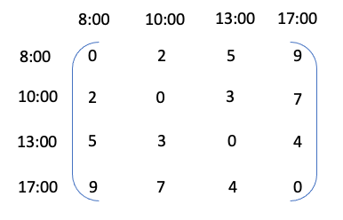

From here we can create an autocorrelation function as a function of these absolute differences. This function can be set up in such a way that the correlation will decay as the difference between the time points increases. For example, we can assume exponential decay as a function of the squared distances, and so the matrix would look like this


Let's assume for a momemt that all the information we need to know about how hunger levels relate to each other is contained within this autocorrelation function matrix. We can create a simple plot to visualise the relationship between the time differences and the autocorrelation values.

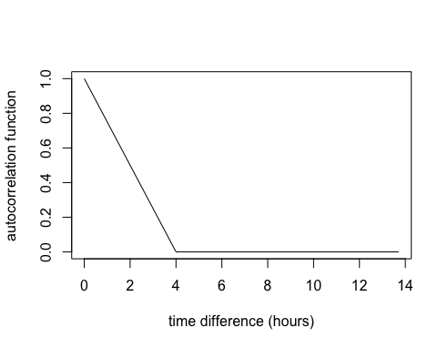

So, if we used this autocorrelation function to define a GP it would imply that once there's 4 hours between measurements they are no longer correlated.

However, in practice for a GP model we would introduce at least two parameters, one for changing the autocorrelation function decay to make it faster/slower and another to turn the autocorrelation function into a covariance function. Then we set up a model such that our measurement values (in this case our hypothetical hunger measurements) can inform the estimation of these parameters.

So hopefully now you have a little bit a intuition for the GP autocorrelation function. What I want to do next is build upon this intuition and simulate some data from a GP model.

## Packages

Here's the packages you'll need if you want to continue. We'll also be using JAGS (Just Another Gibbs Sampler) to fit the GP model. If you need to install JAGS you'll find it here <http://mcmc-jags.sourceforge.net>.

```{r, eval = FALSE}
library(R2jags)
library(runjags)
library(tidyverse)
library(tidybayes)
library(fields)
library(mvtnorm)
```

## Simulating data from a GP

**Building the autocorrelation function**

Let's consider a set of 100 unevenly spaced time points from year 1 to 200. I'm going to divide the years by 100 because it's easier to work with the smaller scale.

```{r}
set.seed(28061989)
year <- sample(1:200,100) %>% sort
x <- year/100
```

Now we're going to work through some steps for building the autocorrelation function.

**Step 1:** We'll create a matrix of distances between every combination of time points (similar to the matrix I showed for the hunger levels example) using the `rdist` function from the `fields` package.

```{r}
d <- fields::rdist(x)
```

**Step 2:** We're going to create an autocorrelation function which we'll call K. This will be a function of the distances in `d` and we're going to make the correlation function decay exponentially.

```{r}
K <- exp(-d^2)
```

To illustrate this, we'll consider the first time point and we'll look at how the correlation function decays as the distance between the time points increases.

```{r}
plot(d[,1], K[,1], 
     type = "l",
     xlab = "year difference (hundred years)",
     ylab = "autocorrelation")
```

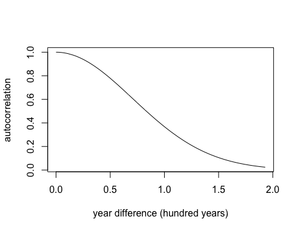

In this case the decay is slow and there is still some correlation even between points that are 200 years apart.

**Step 3:** Now let's assume we want to speed up the decay. I'm going to introduce a parameter, which I'll call &phi;. Watch what happens to the exponential decay if I multiply by &phi;<sup>2</sup> = 5<sup>2</sup>

```{r}
phi <- 5
K <- exp(-(phi^2)*(d^2))
plot(d[,1], K[,1], 
     type = "l",
     xlab = "year difference (hundred years)",
     ylab = "autocorrelation")
```

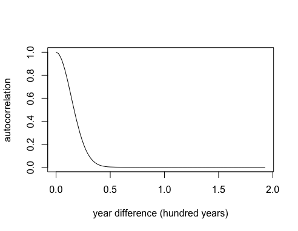

The correlation is dropping to zero after about 50 years. Note this is just one type of autocorrelation function known as a powered-exponential function, but there are many others you can choose from. 

**Simulating GP realisations using a multivariate normal distribution**

Now we are going to make some distributional assumptions about the GP such that it has a multivariate normal (MVN) distribution with mean 0 and covariance matrix &Sigma; = K. Note the mean doesn't have to be 0 but I'm making this assumption here for simplicity. We can use the `rmvnorm` function to generate realisations of the GP and see what they look like.

```{r}
set.seed(28061989)
g <- mvtnorm::rmvnorm(5, sigma=K) # mean defaults to 0
matplot(x, t(g), 
        type="l", 
        ylab="g")
```

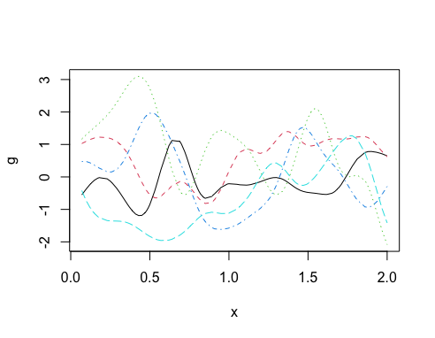

I suggest you change the value of &phi; to get a feel for the impact that it has on the autocorrelation function and the subsequent GP realisations.

**Adding in a variance parameter**

Now let's consider another parameter (&sigma;<sub>g</sub>) which is a standard deviation parameter that controls the variance of the GP i.e., it will control the range of possibilities on the y-axis. So for example, if the GP is centered on 0 and &sigma;<sub>g</sub> = 2, then expect to see a y-axis range of about &plusmn; 6 (i.e., &plusmn; 3 standard deviations). The parameter is introduced into the covariance function as a variance, such that &Sigma; = &sigma;<sub>g</sub><sup>2</sup>K. Let's look at the impact it has on the y-axis range compared to the previous plot.

```{r}
set.seed(28061989)
sigma_g <- 2
g <- rmvnorm(5, sigma=(sigma_g^2)*K)
matplot(x, t(g), 
        type="l", 
        ylab="y")
```
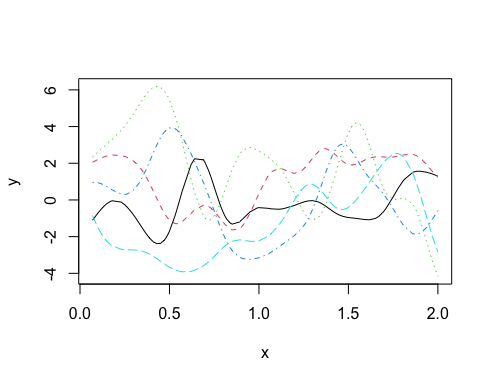

Note how the shape of the curves didn't change but the range of the y-axis did change.

**Simulating data with additional noise**

Now we'll simulate data assuming that the underlying mechanism driving the variation over time is a GP, but we'll also assume that there's additional random variation in the data too. In this case we'll need one more parameter to describe the random variation, we'll call this &sigma;<sub>y</sub>.

```{r}
set.seed(28061989)

sigma_y <- 0.3
eps <- rnorm(100,0,sigma_y) # random noise

g <- rmvnorm(1, sigma=(sigma_g^2)*K) # GP

y <- c(g) + eps # Simulated data = GP + random noise

```

Now, store and plot the simulated data and the simulated GP.

```{r}
dat = tibble(year = year,
             x = x,
             y = y, 
             gp = c(g))

ggplot(dat, aes(x = year, y = y)) +
  geom_point(aes(colour = "Simulated Data")) +
  geom_line(aes(x = year, y = gp, colour = "Gaussian Process")) +
  labs(colour = "")
```
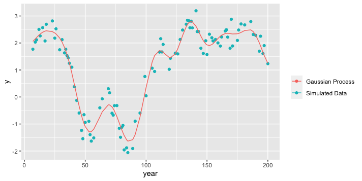

## Run the GP model

Now we're going to pretend that our simulated data is real life data (i.e., we don't know the parameter values or the true underlying GP) and run the GP model using JAGS. First, it's always a good idea to write down the model specification. We'll break it down into three components.

**process model**

We'll assume that the expected value of our observed outcome, y is a GP where

&mu;<sub>y</sub>= g ~ MVN(0, &Sigma;)

&Sigma; = &sigma;<sub>g</sub><sup>2</sup> exp(-(&phi;d)<sup>2</sup>)

**data model**

We'll link the observations to the process through a normal data model that allows us to account for the additional random variation in the data.

y ~ N(&mu;<sub>y</sub>, &sigma;<sub>y</sub><sup>2</sup>)

**priors**

We need priors for all unknown parameters. All parameters should be constrained to be positive.

Here is a JAGS specification for this model:

```{r}
gp_model <- '
model{

  gp ~ dmnorm(mu,Sigma.inv)
  Sigma.inv <- inverse(Sigma)
  
  for(i in 1:n_obs)
  {
    mu[i] <- 0
    Sigma[i,i] <- sigma_g^2 + 0.00001
    for(j in (i+1):n_obs) {
    Sigma[i,j] <- sigma_g^2*exp(-(phi^2)*(d[i,j]^2))
    Sigma[j,i] <- Sigma[i,j]
    }
      
    y[i]~dnorm(gp[i],sigma_y^-2)
  }
  
  sigma_g ~ dt(0,10^-2,1)T(0,)
  phi ~ dt(0,4^-2,1)T(0,)
  sigma_y ~ dt(0,10^-2,1)T(0,)
}

'
```

Once you've specified your JAGS model, the next step is to set up the data to give to the model. Everything that is not a parameter to be estimated needs to be supplied as data in a list.

```{r}
### get data and estimation years
x <- dat %>% pull(x)
y <- dat %>% pull(y)
n_obs <- length(x)
dist <- rdist(x) 


###The required data
jags_data <- list(y = y,
                  n_obs=n_obs,
                  d = d) 
```

Before running the model, decide which parameters you want to be stored in the output. Then run the model by supplying the data and parameters and connecting to the model specification code.

```{r, eval = FALSE}
##parameters to save
jags_pars <- c("sigma_g",
               "phi",
               "sigma_y")  
##run the model
mod <- jags(data = jags_data, 
            parameters.to.save=jags_pars,
            model.file = textConnection(gp_model),
            n.iter = 5000,
            n.burnin = 1000,
            n.thin = 4)

##create an object containing the posterior samples
m <- mod$BUGSoutput$sims.matrix
```

## GP Model Results


We'll format the posterior samples for the parameters using the `spread_draws` function from the `tidybayes` package.

```{r, message=FALSE}
par_dat <- m %>% spread_draws(sigma_g,phi, sigma_y)
```

__Posteriors for GP model parameters__

Now we can look at the posterior distributions of the parameters vs. the true values.

```{r}
ggplot(par_dat, aes(x = sigma_g)) +
  stat_halfeye() +
  geom_vline(data = tibble(sigma_g), aes(xintercept = sigma_g, colour = "True value"))+
  labs(colour = "")
```
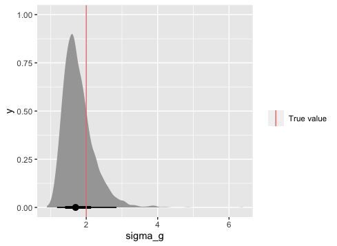

```{r}
ggplot(par_dat, aes(x = phi)) +
  stat_halfeye() +
  geom_vline(data = tibble(phi), aes(xintercept = phi, colour = "True value"))+
  labs(colour = "")
```
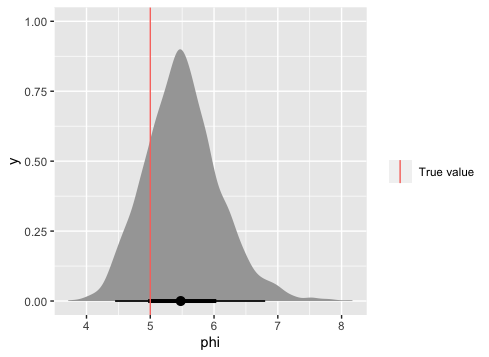

```{r}
ggplot(par_dat, aes(x = sigma_y)) +
  stat_halfeye() +
  geom_vline(data = tibble(sigma_y), aes(xintercept = sigma_y, colour = "True value"))+
  labs(colour = "")
```
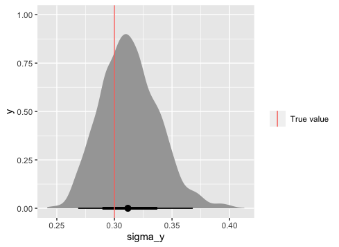


These look good. Next we want to create some predictions from the Gaussian Process model. This requires a little bit more work but there's really no getting around it.

__Predicting from a GP__

We'll assume that we want to predict some new y values (y<sup>* </sup>) for some given new x values (x<sup>* </sup>). We can predict y<sup>* </sup> based on the following Multivariate normal (MVN) predictive distribution

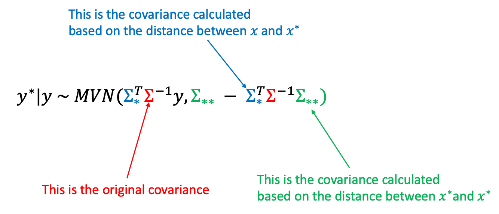

Now that we know the formulas for the mean and covariance of this distribution we can easily create the predictions using the posterior estimates of the model parameters.

Let's first create x<sup>*</sup> and the covariance matrices &Sigma;, &Sigma;<sub> * </sub> and &Sigma;<sub>**</sub> highlighted in the equation above.

```{r}
n_pred <- 50 # number of predictions
x_star <- seq(min(x), max(x), length.out = n_pred) # new x values

par_est<- par_dat %>% 
                 mean_qi(sigma_g, phi, sigma_y) # posterior estimate for pars


Sigma <-  par_est$sigma_y*2 * diag(n_obs) + par_est$sigma_g^2*exp(-(par_est$phi^2)*rdist(x,x)^2)
Sigma_star <- par_est$sigma_g^2*exp(-(par_est$phi^2)*rdist(x_star,x)^2)
Sigma_star_star <- par_est$sigma_g^2*exp(-(par_est$phi^2)*rdist(x_star,x_star)^2)

```

Now estimate the MVN mean and covariance.  These can be used to provide predictions of y<sup>*</sup> with uncertainty.  We'll store the predictions and 95% uncertainty bounds in a tibble. 

```{r}
pred_mean <- Sigma_star %*% solve(Sigma, y)
pred_var <- Sigma_star_star - Sigma_star %*% solve(Sigma, t(Sigma_star))

pred_res <- tibble(pred_mean = pred_mean, 
              year = x_star*100,
              lwr_95 = pred_mean - 1.96 * sqrt(diag(pred_var)), 
              upr_95 = pred_mean + 1.96 * sqrt(diag(pred_var)))

```

Plot the results by overlaying the predictions and uncertainty on the original data. Also, remember in this case we can compare the estimated GP (black line) to the truth (pink line).

```{r}
ggplot(pred_res, aes(x = year, y = pred_mean)) +
  geom_line() +
  geom_ribbon(aes(ymin = lwr_95, ymax = upr_95), alpha = 0.3) +
  geom_point(data = dat, aes(x = year, y = y), alpha = 0.2) +
  geom_line(data = dat, aes(x = year, y = gp, colour = "true GP")) +
  labs(y = "y", colour = "", fill = "") +
  theme_bw() 
```
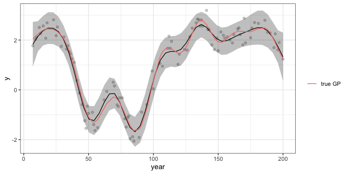


 
## Summary

Most of what you need to know about a GP is contained with the autocorrelation/covariance function. It's pretty easy to simulate time dependent data from a GP model once you can create an autocorrelation function. Once you fit a GP model (in this case with JAGS) and know the form of the predictive distribution you can easily obtain model predictions with uncertainty using the posterior estimates of the GP model parameters. 

