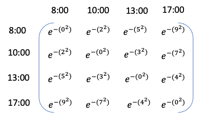

---
title: Understanding Gaussian Process Models for Time Series Data
summary: My aim here is to try to provide the intuition for using a Gaussian process (GP) as a smoother for unevenly spaced, time dependent data.
authors:
  - admin
date: "2021-02-18T13:00:00Z"
lastMod: "2021-02-18T00:00:00Z"
#tags: []

# Is this a featured talk? (true/false)
featured: false

#image:
#  caption: ''
#  focal_point: Right
---

## Introduction

My aim here is to try to provide the intuition for using a Gaussian process (GP) as a smoother for unevenly spaced, time dependent data. In my own research I have mostly used GPs in the context of modelling changes in relative sea level over time. I have often found myself in the position of trying to explain GP models to people that don't have a statistical background. I'm not sure I've always managed to do a great job, but I'll take stab at it again here.

The thing you always need to be aware of with modelling time dependent data is that observations measured over time are not independent.

You need to consider something called auto-correlation (i.e., when the series of observations is correlated with itself in some way). The key to learning about Gaussian Processes is to understand the autocorrelation function.


When developing a GP model in time series context, the autocorrelation function provides the key information on the correlation between the observed data points. The information is based on how far apart the data points are in time, with the assumption being that the further away points are from each other the less correlated the will be.

As a very simple analogy, let's assume that we have some measurement of hunger levels at 8:00, 10:00, 13:00 and 17:00 in a given day. Your hunger levels at 10:00 are going to depend on 8:00 levels. For example, if levels are very high at 8:00 then it's likely you will eat something and as a result levels will be lower at 10:00. By 13:00 your levels will mostly be related to 10:00 but may still have some dependence on 8:00. By 17:00 hunger levels are likely to to be unrelated to 8:00 but will have some relationship with 13:00.

If we were to model a time series of hunger level observations using a GP we would be trying to describe how the hunger levels are related to each other based on considering the absolute time difference between measurements. A matrix of all the combinations of time differences would look like this


We can then create an autocorrelation function as a function of these absolute differences. This function can be set up in such a way that the correlation will decay as the difference between the time points increases. For example we can assume exponential decay as a function of the squared distances which would look like this



The information about how hunger levels relate to each other is contained within this autocorrelation function matrix. Now can create a simple plot to visualise the relationship between the time differences and the autocorrelation values.


Using this function to define a GP would imply that once there's 4 hours between measurements they are no longer correlated.

However, notice that we haven't used any information about actual hunger measurements yet, only the time differences between measurements. In practice, for a GP model we would introduce at least two parameters, one for changing the autocorrelation function decay to make it faster/slower and another to turn the autocorrelation function into a covariance function. Our measurement values (in this case our hypothetical hunger measurements) can then inform the estimation of these parameters.

So hopefully now you have a little bit a intuition for the GP autocorrelation function. What I want to do next is build upon this intuition and simulate some data from a GP model.

## Packages

Here's the packages you'll need if you want to continue. We'll also be using JAGS (Just Another Gibbs Sampler). If you need to install JAGS you'll find it here <http://mcmc-jags.sourceforge.net>.

```{r, eval = FALSE}
library(R2jags)
library(runjags)
library(tidyverse)
library(tidybayes)
library(fields)
library(mvtnorm)
```

## Simulating data from a GP

**Building the autocorrelation function**

Let's consider a set of 100 unevenly spaced time points from year 1 to 200. I'm going to divide the time points by 100 because it's easier to work with the smaller scale.

```{r}
set.seed(28061989)
year <- sample(1:200,100) %>% sort
x <- year/100
```

Now we're going to work through some steps for building the autocorrelation function.

**Step 1:** We'll create a matrix of distances between every combination of time points using the `rdist` function from the `fields` package.

```{r}
d <- fields::rdist(x)
```

**Step 2:** We're going to create an autocorrelation function which we'll call K. This will be a function of the distances in `dist` and we're going to make the correlation function decay exponentially.

```{r}
K <- exp(-d^2)
```

To illustrate this, we'll consider the first time point and we'll look at how the correlation function decays as the distance between the time points increases.

```{r}
plot(d[,1], K[,1], 
     type = "l",
     xlab = "year difference (hundred years)",
     ylab = "autocorrelation")
```


In this case the decay is slow and there is still some correlation even between points that are 200 years apart.

**Step 3:** Now let's assume we want to speed up the decay. I'm going to introduce a parameter, which I'll call $\phi$. Watch what happens to the exponential decay if I multiply by $\phi^2 = 5^2$

```{r}
phi <- 5
K <- exp(-(phi^2)*(d^2))
plot(d[,1], K[,1], 
     type = "l",
     xlab = "year difference (hundred years)",
     ylab = "autocorrelation")
```


The correlation is dropping to zero after about 50 years. Note this is just one type of autocorrelation function known as a powered-exponential function, but there are many others you can choose from. 

**Simulating GP realisations using a multivariate normal distribution**

Now we are going to make some distributional assumptions about the GP such that it has a multivariate normal (MVN) distribution with mean 0 and covariance matrix $\Sigma = K$. Note the mean doesn't have to be 0 but I'm making this assumption here for simplicity. We can use the `rmvnorm` function to generate realisations of the GP and see what they look like.

```{r}
set.seed(28061989)
g <- mvtnorm::rmvnorm(5, sigma=K) # mean defaults to 0
matplot(x, t(g), 
        type="l", 
        ylab="g")
```


I suggest you change the value of $\phi$ to get a feel for the impact that it has on the GP realisations.

**Adding in a variance parameter**

Now let's consider another parameter ($\sigma_g$) which is a standard deviation parameter that controls the variance of the GP i.e., it will control the range of possibilities on the y-axis. So for example, if the GP is centered on 0 and $\sigma_g = 2$, then expect to see a y-axis range of $\sim \pm 6$ (i.e., $\pm$ 3 standard deviations). The parameter is introduced into the covariance function as a variance, such that $\Sigma = \sigma_g^2K$. Let's look at the impact it has on the y-axis range compared to the previous plot.

```{r}
set.seed(28061989)
sigma_g <- 2
g <- rmvnorm(5, sigma=(sigma_g^2)*K)
matplot(x, t(g), 
        type="l", 
        ylab="y")
```


Note how the shape of the curves didn't change but the range of the y-axis did change.

**Simulating data with additional noise**

We'll simulate data assuming that the underlying mechanism driving the variation over time is a GP but that there's also additional random variation in the data too. In this case we'll need one more parameter to describe the random variation, we'll call this $\sigma_y$.

```{r}
set.seed(28061989)

sigma_y <- 0.3
eps <- rnorm(100,0,sigma_y) # random noise

g <- rmvnorm(1, sigma=(sigma_g^2)*K) # GP

y <- c(g) + eps # Simulated data = GP + random noise

```

Now, store and plot the simulated data.


```{r}
dat = tibble(year = year,
             x = x,
             y = y, 
             gp = c(g))

ggplot(dat, aes(x = year, y = y)) +
  geom_point(aes(colour = "Simulated Data")) +
  geom_line(aes(x = year, y = gp, colour = "Gaussian Process")) +
  labs(colour = "")
```

