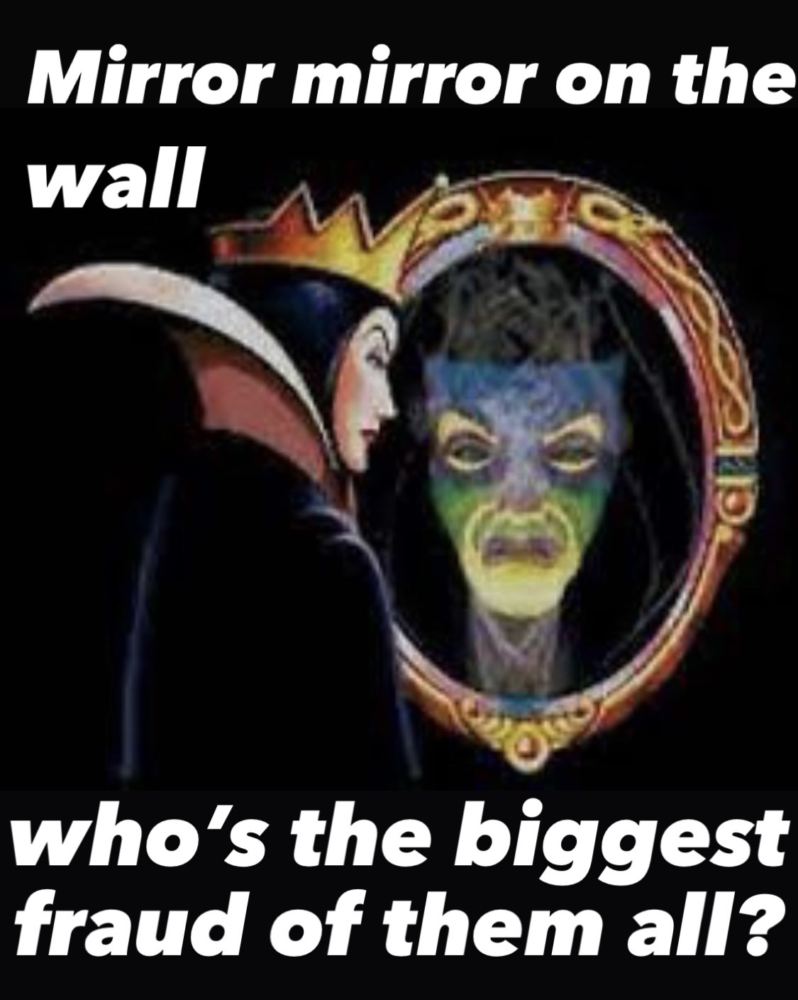

At the end of my M.Sc year, my Bayesian Analysis lecturer sent me an email:

Dear Niamh,

You did really well in the Bayesian Analysis exam and I am wondering if you would be interested in doing a PhD...

### And so it begins...

That lecturer also emailed the same email to one other student in my class. As it turned she was moving away from Ireland and so wasn't interested in doing a PhD here. But, because I knew she had recieved that email too, my exact thoughts at this time were

**"The only reason I got offered this PhD is because she didn't want it."**

That feeling didn't leave me for a long time. I didn't feel like I belonged in a PhD program. PhDs were for super smart people, that was not me. Also, I knew absolutely nothing about the world of academia. I didn't know the difference between an Impact Factor and the X Factor. I felt like everyone around me was smarter and more clued-in than I was and I frequently had thoughts along the lines of

**"I don't understand this, but I can't say anything because then they'll know I don't belong here."**

So what did I do? Despite these feelings, I always tried. I said yes to things that scared the crap out of me. I worked really hard and I continued to work hard for 4 years. Overall, I did really enjoy my PhD experience. I had an excellent and supportive supervisor. I gained some confidence along the way, even if it did come and go. I started to get better at coding (relative to how terrible I was in the beginning). I presented my work at lots of conferences and took feedback on board. I worked with lots of wonderful collaborators and went on research visits where I learned so much. I wrote papers with the help those collaborators. I revised papers. I published papers. But, the overriding thought throughout all of this was

**"I just got really lucky."**

And then, towards the end of my PhD, I had a complete crisis of confidence again.

Sure, I was now pretty comfortable with the work I was doing, but I did that work with the help of my supervisor and collaborators. Without them, I wouldn't have been able to do any of it. I was constantly thinking: "I can't be an independent researcher." "I can't do a postdoc, I don't know enough.", "I don't belong in academia." "Literally everyone in my field is smarter than me."

**"I'll never be as good as they are."**

BUT, thankfully I did end up doing a postdoc and I can honestly say it was one of the best things that ever happened to me. Of course there were ups and downs and it took me a while to get to grips with a new field of research, but I had a wonderful supervisor and I found my feet relatively quickly.

[Sidenote: If I could give one piece of advice to PhD students it would be don't be afraid to reach out to people that you would like to work with, even if you don't know them in person. The worst that could happen is that they ignore your email and the best that can happen is that a year later you end up doing a postdoc with them.]

Funnily enough, the time I spent as a postdoc was the time I felt least like an imposter in the world of academia. I'm not sure why exactly, I guess part of it was just knowing more about how the world of academia worked. It also helped that I hit the postdoc jackpot. I loved the work I was doing and for the first time I had thoughts like

**"I feel confident about my ability to do this."**

So the imposter syndrome was kept at bay for a little while, but it never disappeared, instead it just reared its ugly head in new ways.

One way it currently affects me is when I'm asked to review papers. I never feel like I know enough to review a paper and do it justice. I feel like I'll say something really stupid in my review comments or miss something really obvious. I often find myself thinking

**"I bet the other reviewers will do a much better job at this than I will."**

But, I do review papers of course and I try my best to do a good job. Where possible I read through the other reviewers comments to see if they were similar to mine (or condradict mine) and to try to learn from different reviewing styles. I do think there's a learning curve associated with reviewing and that its something I will hopefully gain more confidence with over time.

Other occasions where my brain screams IMPOSTER at me, is when I'm the only statistician on a paper and it gets media attention (note: this isn't something that happens very often). The fear here is not very logical but this honestly gives me so much anxiety. I feel like, "Oh no! Now my work is getting attention and someone will read it and discover all the statistical analysis is completely wrong." Or I'll constantly be checking over the code because I think

**"someone will look at my code and discover I've made a huge mistake somewhere."**

And please don't get me started on doing media interviews. In 2020 I did a couple of interviews for a newspaper and local radio about a publication that I was a co-author on. I can't remember a time when I felt more nervous talking about research. There were sweaty palms, heart palpipitations, you name it, I felt it. In the end I got through it without any major malfunctions. Also, my parents were super proud to hear me and the radio, so "silver linings" and all that.

Then there's grant writing. I will caveat this by saying that I don't really see myself as an "ideas person" and I found the thought of writing a grant proposal really daunting. But, I persevered (with help from some wonderful colleagues) while thinking

**"there's no way this will ever get funded, it's not good enough."**

So imagine my surprise when I get positive reviews back on a grant. Now, this is academia so positive reviews do not equal funding but in any case now my thoughts turn to

**"what if I do actually get this funded and I can't do any of the things I said I would do?"**

Finally, and one of my biggest sources of work related anxiety these days, is being a supervisor. I constantly worry about the direction of graduate student projects and whether or not I'm sending the students that I supervise down the right path. I think

**"what if I'm not a good mentor and I fail them?"**

In some ways, I equate supervising students with parenting because I have similar feelings about being a Mother. I feel like their futures are in my hands and I am just learning as I go and trying desparately not to mess it up. 

So overall, I think feelings related to imposter syndrome evolve and I doubt I'll ever be free of them. Part of me is glad that it keeps me humble, even though I could do without the anxiety that it brings sometimes. Also, for me, the pros of academia out-way the cons. So I guess my take home message from all of this is, if you love academia but you're scared of failing and you feel like you don't belong, just feel the fear and give it a go anyway.

