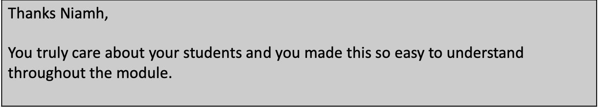

# The Transition

The beginning of the new academic year in September 2021 was my first time Face to Face (F2F) teaching for \~ 18 months and I was extremely anxious about going back for a few reasons.

### Out of practice

I hadn't stood up in front of a large group of people for quite a long time and I wasn't really sure what my F2F teaching style even was anymore. I had become very comfortable with pre-recording my lectures and in particular being able to edit them. I really needed to build my confidence back up again for standing up, speaking out and making mistakes.

### Childcare

I have a 4 year old son and being without childcare for covid related reasons was a constant source of worry. Thankfully, we got through the semester without much disruption. However during the semester and without the benefit of hindsight, every slight cough or runny nose provided a lovely (not) microdose of anxiety.

### Back to normal?

The narrative was that campus life was going "back to normal". But everything was very far from normal. We all had to be constantly on guard for covid symptoms. Two days before term started I got a PCR test because I had a cold and needed to rule out covid. I was doing antigen tests regularly througout the semester. Masks were mandadated for lectures. Vaccines were not. Students needed online options in case they couldn't attend lectures. Lecturers had to find a way to provide the hybrid. Overall, I think this contributed to baseline anxiety levels being higher than ever among both students and staff.

### Covid

Masks were mandated just before the semester started and so I was a bit concerned have having to police that (in the end I had nothing to worry about, students were very respectful in lectures about wearing masks which was a huge relief). My worries about getting covid were more related to passing it onto somebody else (my unvaccinated 4yr old son, or my parents) and this worry increased as we went through the semester. Cases were (are) very high and nightclubs etc reopened in the middle of the semester. Towards the end of the semester, while I was genuinely enjoying lecturing F2F and having more meaningful interactions with the students, I was also really starting to feel like I wanted to avoid the University as much as possible. Having the constant covid cloud hang over everything was (is) really exhausting.

# The Teaching

I had two modules this semester. **Data analysis** which was an introductory level module for a group of 2nd year students and **Bayesian Data Analysis** which was an advanced module for final year and MSc students. I had lectured the 2nd year module before. The Bayesian module was brand new. I provided online options for both modules. For Data Analysis with R I had pre-recorded lectures from the previous year. For the Bayesian module I recorded the live lectures.

### Lecture Struture

__Data Analysis__

Both of the modules I lectured had a significant coding component. For the Data Analysis module I structured my lectures such that one of the lectures was slide-based and provided some background, theory and context and then the next lecture was code-based and put content covered in the previous lecture into practice using R. Here's an example lecture structure for this module:

+-------------------------------------------------------+--------+------------------------------------------------------------------------------------------------------------------------------------------------------------+
| Lecture                                               | Type   | Content                                                                                                                                                    |
+=======================================================+========+============================================================================================================================================================+
| Association Between Categorical Variables - Lecture A | Slides | Contingency tables, marginal and conditional distributions, barplots for visualising relationships between groups, Pearsons' Chi-sq test for independence. |
+-------------------------------------------------------+--------+------------------------------------------------------------------------------------------------------------------------------------------------------------+
| Association Between Categorical Variables - Lecture B | R Demo | R functions: table(), barplot(), chisq.test()                                                                                                              |
+-------------------------------------------------------+--------+------------------------------------------------------------------------------------------------------------------------------------------------------------+
|                                                       |        |                                                                                                                                                            |
+-------------------------------------------------------+--------+------------------------------------------------------------------------------------------------------------------------------------------------------------+

The students really seemed to like the mix of both types of lectures. They were encouraged to bring laptops to the R Demo lecture (but this was not a requirement) and I think the more practical based R-lecture helped them stay engaged with the material.

__Bayesian Data Analysis__

My structure for Bayesian Data Analysis was similar, but lectures weren't separated quite so much into a slide-based lecture and a code-based lecture. The students taking this module were much more familiar with R and so code was embedded into most lectures where relevant. Below is an example of the lecture structure for this module. Again, I think the mix of theory and practical aspects to the lectures worked well for the students. 

| Lecture                              | Type          | Content                                                                                                                                                                               |
|--------------------------------------|---------------|---------------------------------------------------------------------------------------------------------------------------------------------------------------------------------------|
| Bayesian Linear Regression with JAGS | Slides + Code | Slides used to introduce Bayesian regression, JAGS model specification, choosing priors, exploring output all with an example data set. Code used to show how this works practically. |
| Varying Intercepts and Slopes Models | Slides + Code | Slides used to talk through extending regression models and the interpretation of the model output. Code used to show how this works practically.                                     |
|                                      |               |                                                                                                              |

__Feedback__ 

Here is some feedback I received on the lecture structure. 

### Interactive Quizzes

When I was teaching remotely I started giving the students short quizzes using a website called [mentimeter](https://www.mentimeter.com). I decided to incorporate these into my F2F lectures this semester. 

__Data Analysis__

For my Data Analysis module I started one lecture each week with a quiz that had 3/4 multiple choice questions. The students could log onto the quiz easily from their phones and could answer the questions anonymously. Once everyone had given an answer a barplot of the results would show on the screen and then I would go through a quick explanation. Here's an example of what the quiz results look like.

__Bayesian Analysis__

For my Bayesian Data Analysis module I used these quizzes at the beginning of the semester before we got into more practical hands on modeling. In this case I framed the questions so that students had to provide an answer. Here's an example of what the quiz results look like in this case.

I think this worked very well in both modules in terms of increasing engagement. Also, the anonymity meant the students would participate without worry about getting the answer wrong.

__Feedback__

Here is some feedback I received on the use of the menti quizzes. 

### Online Options

At the beginning of the semester I made the decision to provide online alternatives for my lectures. Initially I was quite apprehensive about how this would work. However, I am so glad that I committed to it and I think this is something I will continue to do post-pandemic. Here's what worked for me:

1.  I made use of pre-recorded lectures. For my Data Analysis module, I had a full set of pre-recorded lectures which I had prepared last year when I thought this course. I made the relevant videos available to the students each time the topic had been covered in the F2F lectures;

2.  The Bayesian module was new so I decided to do live lecture recordings. I used Panopto and it worked well. Using Panopto also meant that the videos got automatically uploaded to Moodle which was really useful;

3.  I bought my own [webcam](https://www.amazon.co.uk/dp/B07TXNT3GL/ref=pe_27063361_487055811_TE_dp_1) that had a wide angle view. The webcams that were installed in the lecture rooms were static and fixed in place, which wasn't great. Also, I much prefer using my own laptop for teaching and the installed cameras were only connected to the desktops in the lecture rooms. The webcam cost about 50euro and was a worthwhile investment in my opinion;

4.  I made sure I could access everything I needed for my lecture from the web browser. I had my slides on one tab and the R studio server on another tab. This meant that once I hit record on the lecture I didn't need to mess around with switching between screen shares and instead I just toggled between tabs;

5.  Sometimes I would hand write additional calculations during the lectures. For this, I used an app called [replica](https://apps.apple.com/us/app/display-mirror-replica-app/id1468495939) combined with a white board app, both on my ipad. Replica allowed me to replicate my ipad screen on my laptop. I could again share this on a web browser tan, so this was super handy for the lecture recordings. This provided a really good alternative to using the doc-cam or a white board as with these the additional notes would have been hard to capture in the lecture video.

__Feedback__ 

Providing students with online alternatives was by far the thing that was commented on most in module evaluations. Here's some of the feedback I received. 

### Some improvements

**Data Analysis**

-   Based on some feedback, I might update my lecture slides for Data Analysis to embed some more R code into them and to flesh them out a bit more. I provided the students with the R scrips for the Demo classes, but I think having some of the R code in the lecture slides might be helpful when it comes to tying everything together for this particular module.

-   The lecture slides might benefit from some added explanation for when the students look back on them.

**Bayesian Data Analysis**

-   I will try to add more short quizzes for the Bayesian module. I did them in the beginning weeks but with so much material to get through I didn't do them throughout like I did with the Data Analysis module.

-   I will try to fold in some examples of where Bayesian Analysis can be used in industry. I don't have a great perspective on this but I did ask stats twitter for some help and ended up with a thread of some nice [examples](https://twitter.com/NCahill_Stat/status/1460896135040667651?s=20).

These improvements are informed by the feedback below. 

# Pits and Peaks

Something I found really hard this semester is that I felt like I was constantly chasing my tail. Developing the slides and code for an advanced module that was brand new, along with tutorial sheets, assignment sheets and exam papers was alot of work. I didn't feel I had much time left to dedicate to anything else during the semester and I don't feel like I had much room to switch off. I was picking up my laptop most nights after I put my son to bed to catch up on things. I had a paper that I really wanted to finish and I just couldn't find a block of time to sit down and work on it. I feel really guilty about this because there's people relying on me to get this paper published but it just required more of me than I was able to give in terms of mental capacity. So this paper is currently in a pit and I did not manage to tick off the to do list below, but hopefully I can turn it into a peak soon.

The peak of the semester was feeling more connected with the students. I love teaching and engaging with students and I think online teaching made me feel very detached from that. This message from a student taking my Bayesian module made me so happy.

# The End (of the semester)

We're now at the end of the semester and overall I am happy with how it went. Teaching during a pandemic is really hard and I feel like i've been tired now for about 3 months (2 years?) straight but I also feel like getting back to campus sparked some teaching joy in me again. I am pleased that I was able to bring alot of what I learned from online teaching with me into this semester to provide a hybrid model, that is a work in progress, but that was genuinely really appreciated by the students. I'm ending this semester feeling, tired but grateful and privileged to have the job that I do.

